*Construyo software full-stack con IA — de Transformers a sistemas multiagente.*

### ⚡ Acceso rápido

---

## 🌑 Acerca de mí

Ingeniero en Sistemas Computacionales (CDMX 🇲🇽) trabajando en tres frentes que se alimentan entre sí:

- **🤖 Agentes IA** — Sistemas multi-agente, orquestación y enrutamiento de LLMs con **Model Context Protocol**.
- **🧠 Deep Learning** — Transformers, modelos de difusión y bases matemáticas sólidas.
- **🌐 Full-Stack** — Python · TypeScript · Django · React · Astro · NestJS · Next.js.

**Explorando ahora:** arquitecturas agénticas, MCP tooling, e inferencia eficiente local (Ollama, cuantización, despliegue en GPU).

---

## 🐍 Contribution Snake

<!-- La viborita se regenera cada 12h vía GitHub Actions (.github/workflows/snake.yml) -->

  <picture>
    <source media="(prefers-color-scheme: dark)" srcset="https://raw.githubusercontent.com/AnnGeliux/AnnGeliux/output/github-snake-dark.svg" />
    <source media="(prefers-color-scheme: light)" srcset="https://raw.githubusercontent.com/AnnGeliux/AnnGeliux/output/github-snake.svg" />
    
  </picture>

---

## 📊 Engineering Metrics

  
  

## 🦊 Streak Companion

<!-- El zorro evoluciona solo: lee mi racha real de GitHub (9 etapas, fx nuevos al crecer) -->

  

  

---

## 🛠️ Herramientas técnicas

### `Core Languages`
   

### `AI & Intelligence`
     

### `Full-Stack`
     

### `Infraestructura`
     

---

## 📂 Proyectos Destacados

| Proyecto | Descripción | Stack | Fecha |
| :--- | :--- | :--- | :--- |
| 🔍 **[mcp-inspect](https://github.com/AnnGeliux/mcp-inspect)** | DevTools de escritorio MITM que intercepta, inspecciona y depura tráfico JSON-RPC 2.0 entre servidores y clientes MCP — breakpoints, simulación de fallos y **157 pruebas automatizadas**. | `TypeScript` `Electron` `React` `Node.js` `MCP` | sept 2026 |
| ☕ **[itCoffee](https://github.com/AnnGeliux/itCoffee)** | Sistema de gestión para cafetería multi-sucursal: monorepo con auth por sucursal (Organizations + RBAC fino), desarrollado por fases contra un PRD de **85 historias de usuario**. | `Next.js` `NestJS` `PostgreSQL` `Prisma` `Clerk` | ago 2026 |
| 📚 **[sistemaGestorLecturas](https://github.com/AnnGeliux/sistemaGestorLecturas)** | App web para registrar libros, metas y progreso de lectura con panel de estadísticas y control de usuarios. | `Python` `Django` `MariaDB` | mar 2026 |
| 🌐 **[portfolio](https://github.com/AnnGeliux/portfolio)** | Portafolio personal — **[angelpalestina.dev](https://angelpalestina.dev)** | `Astro` `React` `Tailwind` | live |

---

## 🎓 Certificaciones Recientes

`MCP: Build Rich-Context AI Apps` · DeepLearning.AI × Anthropic — *ago 2026*
`Convolutional Neural Networks` · DeepLearning.AI — *sept 2026*
`Diffusion Models: From Prompts to Images and Video` · AMD AI Academy — *jun 2026*
`AI Agents 101/201: Multi-Agent Systems` · AMD AI Academy — *abr 2026*

---

## 🧱 El Muro — deja tu firma

*Los visitantes pueden grabar su username en el muro. Click abajo → GitHub abre un issue pre-llenado → un Action lo pinta. Sin servidor, sin base de datos — todo vive en este repo.*

  

**[🖊️ Deja tu firma en el muro](https://github.com/AnnGeliux/AnnGeliux/issues/new?title=Add+my+username+to+the+banner!&body=Solo+dale+%27Create%27.+No+necesitas+hacer+nada+m%C3%A1s.)**

🖋️ Firmas en el muro

<!--begin usernames-->
###### [AnnGeliux](https://github.com/AnnGeliux) on 02/10/2026
<!--end usernames-->

Gracias a todos los que firmaron 🙏 · Powered by <a href="https://github.com/BertPlasschaert/TaggableBanner">TaggableBanner</a> (MIT)

---

Profile optimized for high-performance engineering · CDMX · 2026

